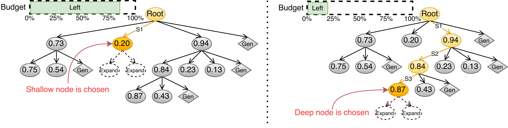
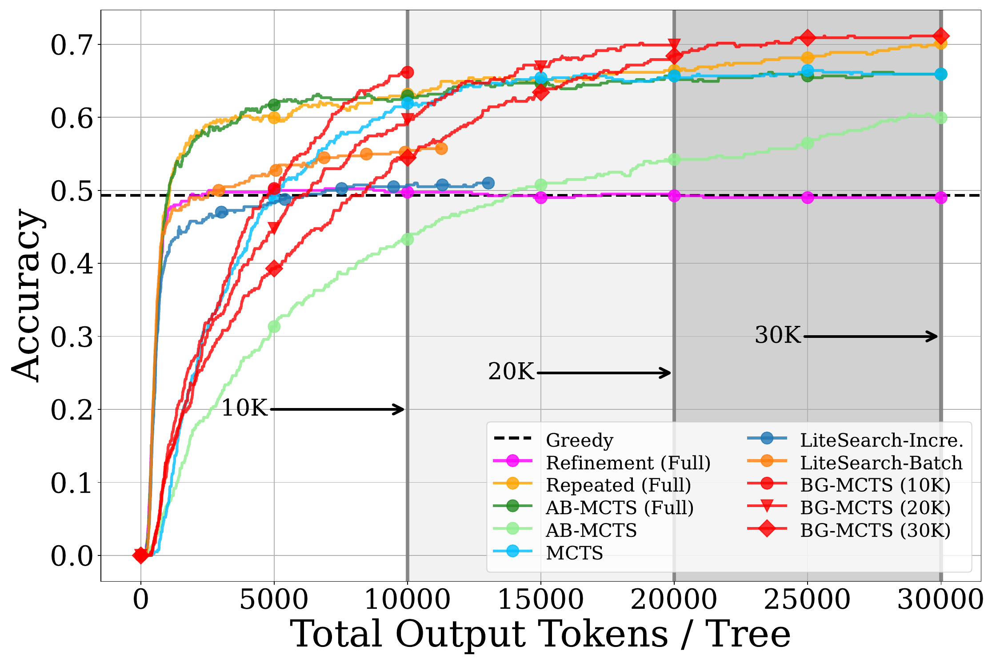
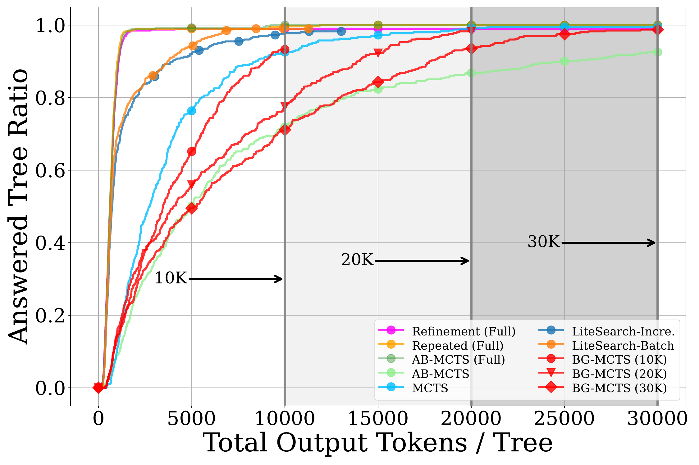
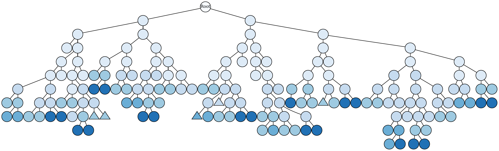
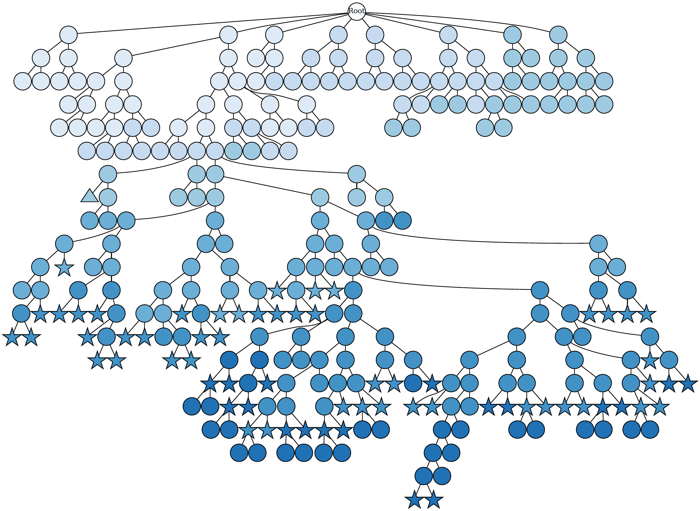

<div align="center">

<h1>Aligning Tree-Search Policies with Fixed Token Budgets in Test-Time Scaling of LLMs</h1>

<div>
    <a href="URL" target="_blank">Sora&nbsp;Miyamoto</a> | 
        <a href="https://daioba.github.io/" target="_blank">Daisuke Oba</a> | 
        <a href="https://www.chokkan.org/index.en.html" target="_blank">Naoaki Okazaki</a>
</div>
<br>

<strong>Accepted to the 43rd International Conference on Machine Learning (ICML 2026).</strong>
<br><br>

[](https://arxiv.org/abs/2602.09574)
[](https://www.apache.org/licenses/LICENSE-2.0)

</div>

## Budget-Guided MCTS (BG-MCTS)
We propose Budget-Guided MCTS (BG-MCTS), a treesearch decoding algorithm that aligns its search policy with the remaining token budget: it starts with broad exploration, then prioritizes refinement and answer completion as the budget depletes while reducing late-stage branching from shallow nodes.

<div align="center">
  
  <br />
  <sub>Conceptual diagram of node selection in BG-MCTS. With a large remaining budget, the policy favors shallow nodes for broad exploration (Left). As the remaining budget decreases, it favors deeper nodes to refine and complete promising candidates (Right).</sub>
</div>

<table align="center">
  <tr>
    <td align="center" width="50%">
      
      <br />
      <sub>Accuracy vs. consumed output tokens on MATH500 Level 5, using Qwen/Qwen2.5-7B-Instruct. Vertical markers indicate the fixed budgets B={10k,20k,30k}.</sub>
    </td>
    <td align="center" width="50%">
      
      <br />
      <sub>Answered-tree rate vs. consumed output tokens on MATH500 Level 5, using Qwen/Qwen2.5-7B-Instruct. Vertical markers indicate the fixed budgets B={10k,20k,30k}.</sub>
    </td>
  </tr>
</table>

<div align="center">
  <hr width="100%">
</div>

<table align="center">
  <tr>
    <td align="center" width="60%">
      
    </td>
    <td align="center" width="40%">
      
    </td>
  </tr>
  <tr>
    <td align="center">
      <sub>(a) MCTS </sub>
    </td>
    <td align="center">
      <sub>(b) BG-MCTS </sub>
    </td>
  </tr>
  <tr>
    <td colspan="2" align="center">
      <sub><strong>Representative tree examples of MCTS vs. BG-MCTS (Llama-3.1-8B-Instruct, MATH500 Level 5, budget 20K). Stars and triangles denote correct and incorrect nodes; color intensity reflects expansion order (darker = later). BG-MCTS adaptively shifts to depth-first as budget depletes.</strong></sub>
    </td>
  </tr>
</table>

## 🔍 Overview

This framework is a research codebase for math reasoning experiments with search-based decoding over large language models. The repository currently focuses on local experiment execution for three math benchmarks: `Math500`, `AIME24_25`, and `Minervamath`. It combines search algorithms from `treesearch`, local vLLM serving, and optional GenPRM-based step evaluation.

## ✨ Features

- Search-based reasoning over step-by-step LLM generations
- Multiple search algorithms exposed through `treesearch`
- Optional GenPRM scoring for intermediate reasoning steps
- Local launcher scripts for experiment execution, progress checks, and evaluation
- Benchmark metadata and task lists for `Math500`, `AIME24_25`, and `Minervamath`

## 🗂️ Repository Layout

- `scripts/run_local_template.sh`
- `scripts/background/local_experiments.sh`parallel task dispatcher used by the launcher
- `experiments/math/run_vllm.py`: math experiment entrypoint
- `src/bg_mcts/`: prompt, task, model, and evaluation logic
- `treesearch/src/treesearch/`: search algorithms
- `benchmarks/`: task ids and problem metadata
- `eval/`: evaluation and plotting utilities

## 🛠️ Requirements

- Linux environment with one or more GPUs
- Python with `uv` available on the command line
- Local vLLM serving workflow
- A `.env` file based on `.env_template`
The repository expects the following variables in `.env`:

```
FOLDER_PATH="/absolute/path/to/bg-mcts/"
HF_TOKEN="your_huggingface_token"
```


## ⚠️ Reproducibility Notice

Due to inherent nondeterminism in vLLM-based generation, exact reproduction of the numerical results reported in the paper is generally not possible, even when using the same settings and environment.

## 🚀 Main Workflow

1. Fill in the experiment settings in `scripts/run_local_template.sh`
2. Run `run_local_template`
3. Check the experiment progress (optional)
4. Evaluation

### 1. 📝 Fill in the experiment settings

Edit `scripts/run_local_template.sh` before launching an experiment.

- Set the experiment identifier in `EXP_ID`
- Choose the benchmark with `TASK` and the task list with `INDICES_FILE`
- Choose the search method with `ALGO_CLASS_NAME`
- Set the budget with `LIMIT_RULE` and `MAX_NUM_COST` or `MAX_NUM_NODES`
- Choose the generation model with `MODEL`
- Set GPU and server placement such as `GPU_INDICES`, `PORT`, `PRM_GPU_INDICES`, and `PRM_PORT`
- Adjust parallelism with `N_JOBS`

This script writes the generated Hydra config to:

```text
outputs/<TASK>/<EXP_ID>/<MODEL>/<ALGO_CLASS_NAME>_<STOPPING_RULE>/config.yaml
```

### 2. ▶️ Run the launcher script

Launch the experiment with an arbitrary job name:

```bash
bash scripts/run_local_template.sh <job_name>
```

The launcher starts the vLLM server for the generation model, optionally starts the GenPRM server, writes the config file, and then dispatches the experiment jobs in the background.

Logs are written under:

```text
logs/<job_name>/
```

Typical log files are:

- `<job_name>.log`: launcher and experiment log
- `vllm_server.log`: generation model server log
- `prm_vllm_server.log`: GenPRM server log

### 3. 📊 Check the experiment progress

To check whether all tasks in the selected task list have finished, edit `scripts/check_experiments.sh` so that it points to the same experiment settings:

- `EXP_ID`
- `TASK`
- `INDICES_FILE`
- `MODEL`
- `ALGO_CLASS_NAME`
- `STOPPING_RULE`

Then run:

```bash
bash scripts/check_experiments.sh
```

The script checks whether each task has finished.

### 4. 📈 Run evaluation

To process finished runs and generate plots, edit `scripts/eval_math.sh`:

- Add one or more experiment directories to `exp_path_list`
- Add matching display names to `graph_name_list`
- Set `max_cost` to the budget used for the experiment
- Set `file_name` to set the file name of the graph
- Set `path_to_graph` to the directory where evaluation plots will be saved
- Set `path_to_math_tasks` to the task list used in the run

Then run:

```bash
bash scripts/eval_math.sh
```


## 🤖 Supported Algorithms and Models

The algorithms themselves follow the formulations described in the respective papers and are derived from treequest. The concrete implementation used in this repository is based on the treequest codebase cited below.

The repository exposes several search algorithms through `treesearch`, including:

- `SequentialRefinement`
- `RepeatedSampling`
- [`ABMCTSA`](https://openreview.net/pdf?id=jAsr5GHt3P)
- [`ABMCTSM`](https://openreview.net/pdf?id=jAsr5GHt3P)
- [`StandardMCTS`](https://openreview.net/pdf?id=jAsr5GHt3P)
- [`LiteSearchBatch`](https://arxiv.org/pdf/2407.00320)
- [`LiteSearchIncremental`](https://arxiv.org/pdf/2407.00320)
- [`BGMCTS`](https://arxiv.org/pdf/2602.09574)
- [`TreeOfThoughtsBFSAlgo`](https://arxiv.org/pdf/2305.10601)

Model options currently surfaced in `scripts/run_local_template.sh` include:

- [`meta-llama/Llama-3.1-8B-Instruct`](https://huggingface.co/meta-llama/Llama-3.1-8B-Instruct)
- [`meta-llama/Llama-3.2-3B-Instruct`](https://huggingface.co/meta-llama/Llama-3.2-3B-Instruct)
- [`Qwen/Qwen2.5-7B-Instruct`](https://huggingface.co/Qwen/Qwen2.5-7B-Instruct)
- [`Qwen/Qwen3-8B`](https://huggingface.co/Qwen/Qwen3-8B)
- [`Qwen/Qwen3-14B`](https://huggingface.co/Qwen/Qwen3-14B)
- [`Qwen/Qwen3-32B`](https://huggingface.co/Qwen/Qwen3-32B)
- [`google/gemma-3-4b-it`](https://huggingface.co/google/gemma-3-4b-it)
- [`google/gemma-3-12b-it`](https://huggingface.co/google/gemma-3-12b-it)

## 📌 Notes and Limitations

- The repository is optimized for local research workflows rather than packaged-library usage.
- The current setup assumes local vLLM serving.
- Several scripts are intentionally manual and require editing shell variables before execution.
- GenPRM is the implemented PRM workflow in the current codebase.
- The README focuses on practical execution. Deep implementation details should be read from the code directly.

## 📚 Citation

If you release a paper or preprint for Bg-MCTS, add the citation here.
```bibtex
@misc{miyamoto2026aligningtreesearchpoliciesfixed,
      title={Aligning Tree-Search Policies with Fixed Token Budgets in Test-Time Scaling of LLMs}, 
      author={Sora Miyamoto and Daisuke Oba and Naoaki Okazaki},
      year={2026},
      eprint={2602.09574},
      archivePrefix={arXiv},
      primaryClass={cs.CL},
      url={https://arxiv.org/abs/2602.09574}, 
}
```

## 🙏 Acknowledgements
- This codebase is developed on top of [ab-mcts-arc2](https://github.com/SakanaAI/ab-mcts-arc2)

- The tree search algorithms are based on [treequest](https://github.com/SakanaAI/treequest), and this repository uses a locally cloned version at commit ```57f60f47f85a243e4be5add3887e5f1f787650c1``` .
